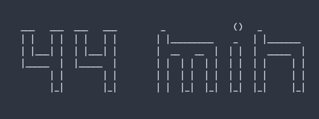

# PomodoroCount

Creates a Pomodoro Counter in the Command Line. 

The Command below starts the Counter with 45 min study time and a 5 min break. 
```sh 
  java Countdown 45 5 
```
The Current time gets displayed like 


